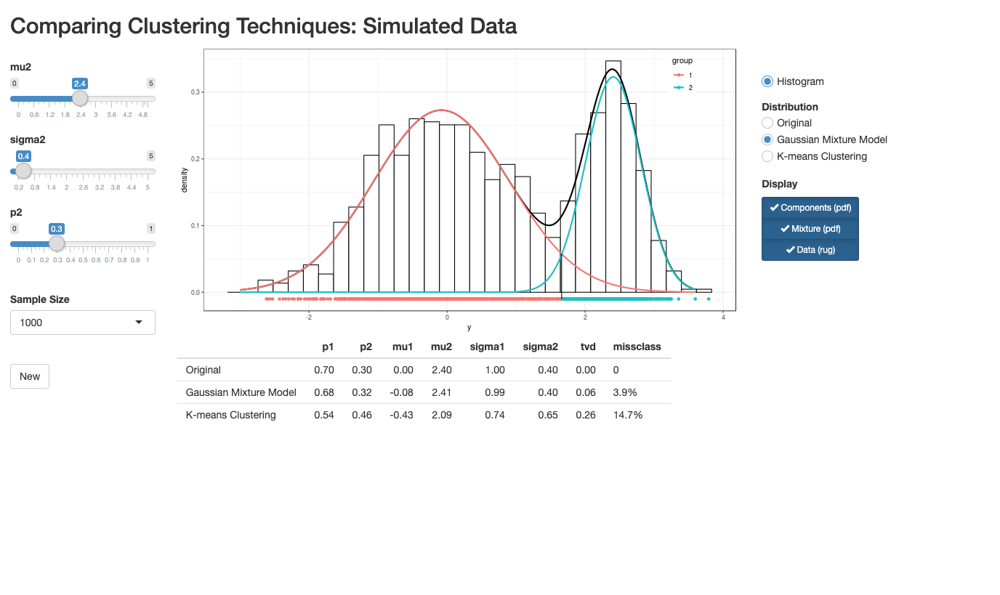
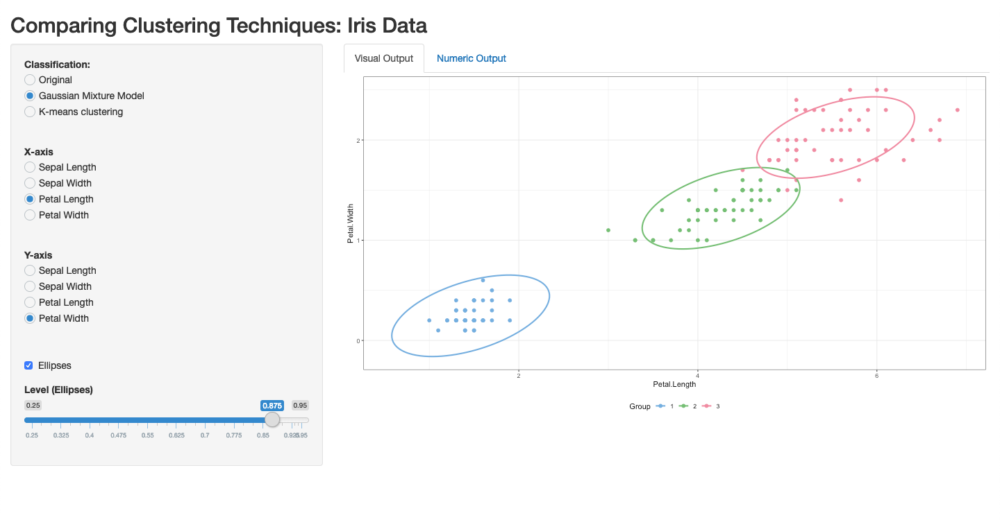

# Two Shiny Apps for Comparing Clustering Algorithms
### Exploring and Comparing Unsupervised Machine Learning Clustering Algorithms

These Shiny apps are a part of a broader series of projects with [Marc Lavielle](http://www.cmap.polytechnique.fr/~lavielle/).

_Note:_ This repository accompanies a software paper, "Exploring and Comparing Unsupervised Machine Learning Clustering Algorithms", which is soon to be under review.

In this repo, we include code for two original Shiny apps for directly comparing two prominent unsupervised machine learning clustering techniques: k-means and Gaussian mixture models (for classification, not prediction, in our case). The goal is to offer researchers and scholars easy-to-use tools for comparing, mapping, and exploring the mechanics of these widely used clustering algorithms. The first app simulates data and the second app uses the Iris data as a sample, and includes both visual and numeric comparisons. 

Please cite the use of these tools in any published work.

The first app using simulated data can be found here: <https://pdwaggoner.shinyapps.io/App1-Simulated_Data/>

And the second app using the Iris data can be found here: <https://pdwaggoner.shinyapps.io/App2-Iris_Data/>

Here is a quick demo of each:

