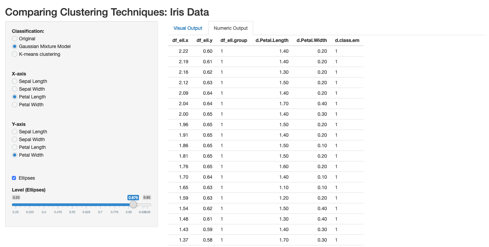

# Two Shiny Apps for Comparing Clustering Algorithms
### Exploring and Comparing Unsupervised Clustering Algorithms

These Shiny apps are a part of a broader series of projects with [Marc Lavielle](http://www.cmap.polytechnique.fr/~lavielle/).

_Note:_ This repository accompanies a software paper, "Exploring and Comparing Unsupervised Clustering Algorithms", which is currently under review.

In this repo, we include code for two original Shiny apps for directly comparing two prominent unsupervised machine learning clustering techniques: k-means and Gaussian mixture models (for classification, not prediction, in our case). The goal is to offer researchers and scholars easy-to-use tools for comparing, mapping, and exploring the mechanics of these widely used clustering algorithms. The first app simulates data and the second app uses the Iris data as a sample, and includes both visual and numeric comparisons. 

Please cite the use of these tools in any published work.

The first app using simulated data can be found here: <https://pdwaggoner.shinyapps.io/App1-Simulated_Data/>

And the second app using the Iris data can be found here: <https://pdwaggoner.shinyapps.io/App2-Iris_Data/>

Here is a quick demo of each:

## Diagnosing the Output

Each of the apps make calculations to cluster the space in real time, dependent on how the user changes global controls and parameters. These calculations vary by clustering technique, where the goals are slightly different across techniques. In k-means, the goal is to partition the space such that each observation is assigned to a single cluster, with all observations belonging to a cluster (i.e., "hard partitioning"). The result is a cluster assignment for each observation based on the optimal configuration, where optimality is defined by minimization of within cluster sums of squares.  Thus when inspecting the output from the apps, we can see this in the *Numeric Output* tab under the column `d.class.km`. The visual output in the Iris app shows how clustering configurations and class assignments shift when the bounds around the clusters are "tightened" or "loosened," via the `Level` parameter. In the simulated data app, similarly we can see the clustering configurations shifting, but as density curves rather than a 2D scatterplot. 

For the Gaussian mixture model output, when using these types of finite mixture models for clustering applications, we get similar output. Yet, in the mixture model case, the goal is different where the optimal cluster configuration is defined by maximizing similarities across cluster assignment probabilities (i.e., "soft partitioning"). *Soft* here assumes that a single observation could belong to multiple clusters, only to varying degrees of probability. In the simulated data app, the visual output is showing how cluster densities change as the mixing weight shifts. When this changes, the intersection between the mixed clusters also changes, which in turn shifts the mixture of densities (i.e., the individual component/cluster means and standard deviations). Thus, `p1` and `p2` correspond with each input feature, `mu1` and `mu2` correspond to the mean (location) of each computed component, and `sigma1` and `sigma2` correspond to the variance (spread/shape) of each component. 

Importantly, in both apps, the terms "cluster" and "component" are used intechangably to make appropriate reference to their origins. "Component" is used in the mixture model world to reference a cluster, whereas "cluster" is used in the k-means world to reference the assignments of observations to similar groups. 

## Contributing

These apps are meant to deepen an applied understanding of unsupervised clustering. If you think there is anything we could change to meet this goal more efficiently, feel free to contribute! Or, if you found a bug or an error that gets in the way fo this goal, please also contribute. 

Regardless of the motivation, anyone is welcome to contribute to these open source tools in one of three ways:

1. Open an issue with the appropriate label (e.g., `bug fix`)
2. Open a pull request with direct changes.
3. Reach out to either Philip or Marc directly with suggestions. 

